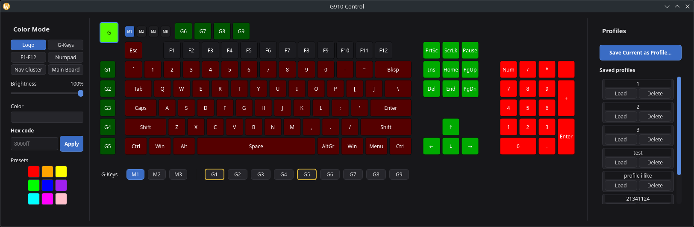

# bigblackclocks

Two Logitech gaming keyboards, the **G510s** and the **G910 Orion
Spectrum** — same family, same era, same problem: nothing on Linux
actually drives their hardware properly. Logitech's own software
(G HUB / Logitech Gaming Software) is Windows-only, and the community
tools that exist for keyboards like these are old and unmaintained.

Here's the annoying bit: even back on Windows, proper software for the
G510s's little LCD screen was never easy to find — half of what's out
there is abandoned or just doesn't work right anymore. So when it came
to Linux, there was nothing at all. Bugger all. Same story with the
G910's per-key RGB lighting — no real Linux option, full stop.

So we sorted it ourselves. This repo talks to each keyboard's actual
hardware directly (real USB/HID traffic, not a guess at what "should"
work) and builds the control software from scratch — one app per
keyboard. The G510s app drives its LCD, buttons, backlight, and macro
keys. The G910 app drives its per-key RGB lighting and macro keys.
Different keyboards, different jobs, but the same rule for both:
nothing went in until it was actually tested and working on the real
keyboard, not just assumed to.

Both apps run as your normal user — no faffing about with root — start
themselves up at login, and just keep working through reboots,
replugs, and kernel updates. Does what it says on the tin.

## The two apps

| Keyboard | Branch | What it does |
| --- | --- | --- |
| **G510s** | `main` (`v1.0`) / **`g510s-dev`** (active work) | **Work in progress** — `main` has the tagged, confirmed `v1.0` (LCD stats, backlight, G-key macros). Everything since has been built and self-tested (including several rounds of self-audit bug-fixing) on `g510s-dev`, not merged here yet: the Custom Screens dashboard builder for L2-L5 (drag sensors, PNG images, and freeform text onto a live preview, resizable images, per-element text sizing), a live analog clock on L1, the Backlight + G-Keys canvas rearchitecture, a real Arch package (`packaging/g510-lcd/`), and a full split of your own data (screens/macros/images) into `~/.local/share/g510-lcd`, independent of wherever the app itself is installed from. Nothing on `g510s-dev` gets tagged or merged until it's physically confirmed on the real keyboard — that's this project's standing rule, not a delay. |
| **G910 Orion Spectrum** | `main` (this branch) | One tidy window built around a proper on-screen render of the keyboard — click any key to colour it, click a cluster to jump to that zone, and M1/M2/M3/MR are real clickable bits of the picture, not just labels. A compact colour picker (real named presets + a hex field, no fiddly gradient square) sits alongside saving/loading whole lighting setups (any number of them, scrolls properly). Device paths are discovered at runtime by matching the actual hardware (vendor/product ID), not a hardcoded path tied to one specific physical keyboard — works on any G910, not just the one it was built on. Comes with its own installer and desktop shortcut, plus a real Arch package (`packaging/g910-control/`) as a second, from-scratch-packaged way to install it. Tagged `g910-v1.2`. Further G910 work happens on the `g910` branch — see [`G910: the short version`](#g910-the-short-version) below for the deep-dive docs. |

### Screenshots

**G910 Control** — the app described above: the keyboard render sits in
the middle (click a key to colour it, click a cluster to pick its zone
in the sidebar, M1/M2/M3/MR are properly clickable), Colour Mode
sidebar on the left with real named-colour presets and a hex field,
G-Keys macro strip tucked under the keyboard, and your saved lighting
Profiles on the right.

**G510s Control** — the same idea, adapted to what this keyboard can
actually do: one sysfs LED for the whole board instead of per-key RGB,
so the keyboard render shows the real live backlight colour across the
main board, G-keys in their own accent colour (click one to record a
macro), and M1/M2/M3/MR shown above the G-key columns. Built and
self-tested 2026-09-14; not yet confirmed on the real hardware by the
user.

Active development for each keyboard now happens on its own branch
(`g510s-dev` for the G510s app, `g910` for the G910 app) and gets merged
back into `main` once a feature is actually done — see
[`BRANCHES.md`](BRANCHES.md) for the full map of every branch and tag
in this repo, including the frozen historical ones like
`legacy-yad-backlight-script` (the original yad/bash backlight script,
kept for old times' sake — the G510s app's Backlight tab does the job
properly now) and `g910-canvas` (the full G910 development history).

Want to actually run the G510s app? `./install.sh` sorts out every
dependency, drops the system files where they need to go, builds
everything, and switches the services on — the one thing it can't do
for you is track down your own copy of the Eurostile Bold font (that's
a licensing thing, not a laziness thing). A real Arch package also
exists (`packaging/g510-lcd/` on `g510s-dev`) — built and its contents
verified via `makepkg`, not yet actually installed on real hardware
(that's a manual `sudo pacman -U` step away, deliberately not run
automatically). The G910 app's got its own installer,
`install-g910.sh`, right here on `main` — or, if you'd rather install
it the "real package" way, `packaging/g910-control/` has a PKGBUILD
that builds and installs it via `makepkg`/`pacman` instead (not yet on
the AUR itself, but builds and runs identically either way — see that
folder's own README for the details).

---

## G510s: the short version

A PyQt5 app (`g510_app.py`) that turns the keyboard's built-in screen
into a live CPU/RAM/VRAM/TEMP display, with a dashboard builder for
the L2-L5 buttons if you fancy making your own layouts. Also does the
RGB backlight and G-key macros across M1-M3 profiles. Talks straight to
`/dev/g510-lcd` and `/dev/g510-keys` (proper stable symlinks, not
flaky device numbers) instead of relying on `g15daemon`, which gets
the key mappings wrong on this keyboard. Runs quietly as three systemd
`--user` services, starts itself at login, shrugs off reboots. Tagged
`v1.0`.

Want the full story — protocol details, every bug we hit and how it
got fixed, the font conversion faff, the udev rules? That's all in
[`G510_README.md`](G510_README.md). Just want to know how to actually
use the Custom Screens editor (add sensors, drag them around, resize
bars)? [`G510_CUSTOM_SCREENS_HOWTO.md`](G510_CUSTOM_SCREENS_HOWTO.md)
is the short version.

Wondering whether this actually works for anyone other than us, not
just on our own machines? [`READY_FOR_ANYONE.md`](READY_FOR_ANYONE.md)
covers that directly.

---

## G910: the short version

A PyQt5 app (`g910_app.py`) built around a real on-screen render of the
keyboard (`g910_canvas.py`) — click any key to colour it, drag-select a
whole area, or use the Colour Mode sidebar to bulk-colour a named zone
(Logo, G-Keys, F-row, Numpad, Nav Cluster, Main Board). G-key macros
across M1-M3 profiles, and any number of saved full-lighting Profiles.
Talks to the keyboard via `keyledsctl`/`libkeyleds.so` over its real
HID++ 2.0 protocol, with device paths discovered at runtime instead of
tied to one physical unit. Runs as a systemd `--user` service for macro
playback, starts itself at login. Tagged `g910-v1.2`.

Want the full story — the HID++ protocol reverse-engineering, every
real bug hit along the way, the canvas rearchitecture from a plain
button grid to real per-key geometry? [`G910_CANVAS_PLAN.md`](G910_CANVAS_PLAN.md)
is the detailed, still-updated build log. [`G910_README.md`](G910_README.md)
and [`G910_SKELETON.md`](G910_SKELETON.md) are the earlier research/
planning and first-skeleton write-ups that led there.

---

## The cheeky bits

A few things that happened along the way worth a mention, because
they're the kind of detail that makes a "personal project" actually
personal:

- The G510s app can show free space on a second drive over its LCD
  like any other sensor, on request — fully optional, shows "N/A"
  gracefully on any setup that doesn't have one.
- Two separate Claude Code sessions ran this whole build, one per
  keyboard, each on its own machine, coordinating over actual messages
  to each other — catching each other's mistakes (a compile-time path
  fallback that still leaked a username, caught by the other session's
  independent re-check), occasionally getting confused by each other's
  shorthand ("Plan A/B" turned out to be a mishearing of "Phase A/B"),
  and generally behaving like two separate contractors who occasionally
  need to double-check they're not about to step on each other's tools.
- "wtf are the blue squares for?" is a genuine, verbatim piece of user
  feedback that shipped an actual UI fix (resize handles now only show
  up when you're hovering near them, not all at once) — which is as
  good a reminder as any that real usage beats guessing every time.

---

## License

[MIT](LICENSE).
