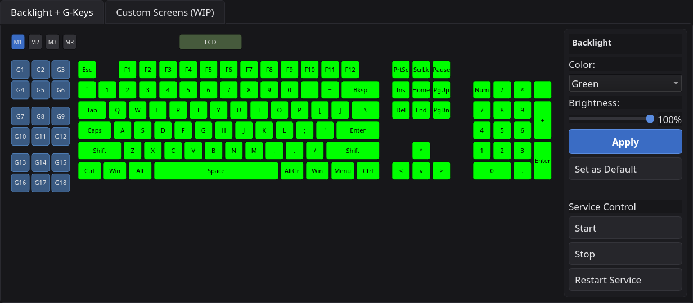

# Logitech G510s software


**A from-scratch Linux driver + GUI for the Logitech G510s** — the LCD
screen, backlight, and G-key macros, properly working. Logitech's own
software is Windows-only and everything else out there is old,
abandoned, or half-broken, so this talks to the keyboard's real
USB/HID traffic directly instead.

## Download & Install

```
git clone https://github.com/grumpybollocks/g510s-control.git
cd g510s-control
./install.sh
```

`install.sh` sorts out every dependency (reporting exactly what's
already installed vs. what it's about to add — never a silent
black-box `pacman` run), builds the LCD driver, converts the label
font, wires up the systemd services, and adds desktop shortcuts. Safe
to re-run any time.

**What you get:**
- Live CPU / RAM / VRAM / TEMP stats on the built-in LCD
- Full RGB backlight colour control
- G-key macros across M1 / M2 / M3 profiles
- Custom Screens dashboard builder — drag sensors, images, and text
  onto L2-L5, plus a live analog clock on L1
- A little Winamp on your keyboard — bouncing equalizer bars for
  whatever's playing, plus the song title, artist, and elapsed time
- Runs as your normal user, starts at login, shrugs off reboots —
  no root faffing about



## The audio visualizer

Drop a visualizer onto any of the L2-L5 screens and the LCD turns into
a tiny live equalizer — bars that actually bounce to the music,
alongside the song title, artist, and a running "1:23 / 3:45" clock.

It doesn't hook into Spotify, or your browser, or any app in
particular — it just listens to whatever's coming out of your
speakers, the same way a physical VU meter would. That means it works
identically with Spotify, YouTube in a browser tab, VLC, a game,
literally anything, with nothing to configure and nothing that can
fall out of sync with "what app is currently playing." Resize it like
any other element and it fills the extra space with more bars, not
just bigger ones.

## How it works

A PyQt5 app (`g510_app.py`) talks straight to `/dev/g510-lcd` and
`/dev/g510-keys` — proper stable symlinks, not flaky device numbers —
instead of relying on `g15daemon`, which gets this keyboard's key
mappings wrong. Runs quietly as three systemd `--user` services.

## Status

- **Public** on GitHub.
- **`main`**: tagged `v1.0` (LCD stats, backlight, G-key macros) —
  stable, confirmed. Analog clock, Custom Screens polish, and several
  real bug fixes have since merged on top, physically confirmed
  working on the real keyboard.
- **`g510s-dev`**: active work, merges to `main` only once it's
  physically confirmed on the real keyboard — standing rule, not a
  delay.
- Not on the AUR — not currently being pursued.

## Not the repo you're after?

This used to also hold a separate app for the Logitech **G910** —
different keyboard, different codebase. That's fully moved out to
[grumpybollocks/g910-control](https://github.com/grumpybollocks/g910-control),
already ahead of anything that was ever here. Every G910 branch and
tag has also been removed from this repo (see [`BRANCHES.md`](BRANCHES.md)
for the full history) — no G910 *file*, branch, or tag has lived on
`main` since 2026-09-17.

## Docs

- [`G510_README.md`](G510_README.md) — the full story: protocol
  details, every bug hit and fixed, font conversion, udev rules.
- [`G510_CUSTOM_SCREENS_HOWTO.md`](G510_CUSTOM_SCREENS_HOWTO.md) — how
  to actually use the Custom Screens editor.

---

## The cheeky bits

A few things that happened along the way worth a mention, because
they're the kind of detail that makes a "personal project" actually
personal:

- The app can show free space on a second drive over its LCD like any
  other sensor, on request — fully optional, shows "N/A" gracefully on
  any setup that doesn't have one.
- This started out alongside a sibling app for the Logitech G910 (see
  "Not the repo you're after?" above) before the split. That history
  predates the split and lives on in this repo's own commit log even
  though the G910 app's files themselves have moved on.
- "wtf are the blue squares for?" is a genuine, verbatim piece of user
  feedback that shipped an actual UI fix (resize handles now only show
  up when you're hovering near them, not all at once) — which is as
  good a reminder as any that real usage beats guessing every time.

---

## License

[MIT](LICENSE).
