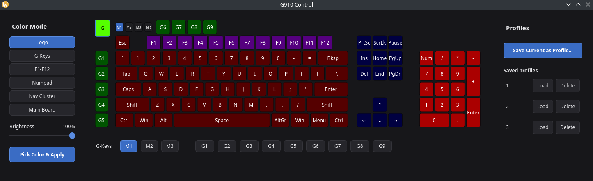

# bigblackclocks

Two Logitech gaming keyboards, the **G510s** and the **G910 Orion
Spectrum** — same family, same era, same problem: nothing on Linux
actually drives their hardware properly. Logitech's own software
(G HUB / Logitech Gaming Software) is Windows-only, and the community
tools that exist for keyboards like these are old and unmaintained.

Here's the annoying bit: even back on Windows, proper software for the
G510s's little LCD screen was never easy to find — half of what's out
there is abandoned or just doesn't work right anymore. So when it came
to Linux, there was nothing at all. Bugger all. Same story with the
G910's per-key RGB lighting — no real Linux option, full stop.

So we sorted it ourselves. This repo talks to each keyboard's actual
hardware directly (real USB/HID traffic, not a guess at what "should"
work) and builds the control software from scratch — one app per
keyboard. The G510s app drives its LCD, buttons, backlight, and macro
keys. The G910 app drives its per-key RGB lighting and macro keys.
Different keyboards, different jobs, but the same rule for both:
nothing went in until it was actually tested and working on the real
keyboard, not just assumed to.

Both apps run as your normal user — no faffing about with root — start
themselves up at login, and just keep working through reboots,
replugs, and kernel updates.

## The two apps

| Keyboard | Branch | What it does |
| --- | --- | --- |
| **G510s** | `main` (this branch) | LCD stats screen (CPU/RAM/VRAM/temps) with a custom AIDA64-style dashboard builder for the L2-L5 buttons, RGB backlight control, G-key macro recording with M1-M3 profiles. Tagged `v1.0`, actively maintained. Full technical deep-dive is the rest of this file. |
| **G910 Orion Spectrum** | [`g910-canvas`](../../tree/g910-canvas) | Single-view GUI built on a real per-key-geometry canvas render of the keyboard: full RGB control (per-key, per-zone, and whole-board), clickable M1/M2/M3/MR cells right on the canvas that mirror the physical keys, G-key macro recording, save/load full lighting profiles, systemd macro daemon. Reboot-safe (stable udev device paths, not raw `hidrawN` numbers) with its own installer + desktop launcher. Reached its `g910-gui-v1` milestone (tag), actively maintained — not yet merged to main. Full technical deep-dive: [`G910_README.md`](../../blob/g910-canvas/G910_README.md) and [`G910_CANVAS_PLAN.md`](../../blob/g910-canvas/G910_CANVAS_PLAN.md) on that branch. |

### Screenshots

**G910 Control** — the app described above: keyboard canvas in the
middle (click any key to color it, click a cluster to select its zone
in the sidebar, M1/M2/M3/MR are real clickable cells), Color Mode
sidebar on the left, G-Keys macro strip under the keyboard, saved
lighting Profiles on the right.

*(G510s app screenshot coming soon.)*

Other branches: `legacy-yad-backlight-script` freezes the original
yad/bash G510s backlight tool as a standalone reference (superseded by
`g510_app.py`'s Backlight tab); `g910` is the G910 app's pre-canvas
history, kept as-is.

Fresh-install setup for the G510s app: run `./install.sh` (installs
every dependency, places system files, compiles, enables services —
see that file for the one thing it CAN'T automate: sourcing your own
Eurostile Bold font). The G910 app has its own `install-g910.sh` on
the `g910-canvas` branch.

---

## G510s: quick summary

PyQt5 app (`g510_app.py`) that turns the keyboard's built-in LCD into
a live CPU/RAM/VRAM/TEMP display (plus a custom AIDA64-style dashboard
builder for the L2-L5 screens), wires up the 5 buttons under it, and
adds RGB backlight control + G-key macro recording with M1-M3
profiles. Talks directly to `/dev/g510-lcd`/`/dev/g510-keys` (stable
udev symlinks) instead of the buggy `g15daemon` community tool. Runs
as 3 systemd `--user` services, autostarts at login, survives
reboots/replugs. Tagged `v1.0`.

Full technical deep-dive (protocol details, bug history, build
gotchas, font conversion, udev rules): [`G510_README.md`](G510_README.md).
